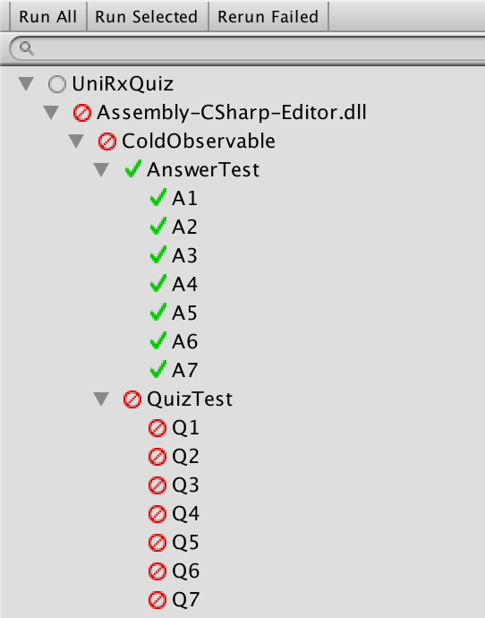

# UniRx Quiz

# How to solve?

All quizzes are described by nunit test.

1. Replace `FIXME` comment to passs all quiz test.
2. Run unit test (Window > Test Runner > Run All) to check your code.
3. Finally see AnswerTest file to check your answer.

All QuizTest files have corresponding AnswerTest files.

# QUIZ

Basics

1. Cold Observable: [Quiz](Assets/Editor/ColdObservable/QuizTest.cs) / [Answer](Assets/Editor/ColdObservable/QuizTest.cs)
2. Hot Observable: [Quiz](Assets/Editor/HotObservable/QuizTest.cs) / [Answer](Assets/Editor/HotObservable/AnswerTest.cs)
3. Operator: [Quiz](Assets/Editor/Operator/QuizTest.cs) / [Answer](Assets/Editor/Operator/AnswerTest.cs)
3. Combinator: [Quiz](Assets/Editor/Combinator/QuizTest.cs) / [Answer](Assets/Editor/Combinator/AnswerTest.cs)

